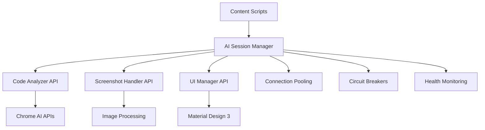

# 🔌 DevMentor AI - API Documentation

> **Complete API reference for DevMentor AI Chrome Extension**

## 📋 **Overview**

DevMentor AI provides a comprehensive API for code analysis, AI processing, and extension management. All APIs are designed for local processing with Chrome's Built-in AI capabilities.

---

## Architecture

### **Core Components**



### **API Layers**

1. **Chrome Extension APIs** - Manifest V3 integration
2. **AI Session Manager** - Core AI processing
3. **Content Scripts** - Page interaction
4. **Background Services** - Service worker management

---

## 🤖 **AI Session Manager API**

### **Core Class: AISessionManager**

```javascript
class AISessionManager {
  constructor()
  async initialize()
  async processCodeWithChaining(code, analysisType, options)
  async generateCodeTransformation(originalCode, improvements)
  async startCollaborativeSession(sessionId, participants)
  async shutdown()
  getMetrics()
}
```

### **Initialization**

```javascript
// Initialize AI Session Manager
const aiManager = new AISessionManager();
await aiManager.initialize();

// Check if AI is ready
if (aiManager.isReady()) {
  console.log('AI Session Manager ready');
}
```

### **Code Processing**

```javascript
// Process code with chaining
const result = await aiManager.processCodeWithChaining(
  code,           // string - Code to analyze
  'explain',      // string - Analysis type
  {               // object - Options
    detailLevel: 'intermediate',
    includeExamples: true,
    language: 'javascript'
  }
);

// Response structure
{
  analysis: {
    summary: 'Code explanation...',
    details: [...],
    examples: [...],
    improvements: [...]
  },
  metadata: {
    processingTime: 1.2,
    confidence: 0.95,
    language: 'javascript'
  }
}
```

### **Analysis Types**

| Type | Description | Options |
|------|-------------|---------|
| `explain` | Educational explanation | `detailLevel`, `includeExamples` |
| `debug` | Bug detection | `severity`, `includeFixes` |
| `optimize` | Performance optimization | `focus`, `benchmark` |
| `document` | Documentation generation | `format`, `style` |

---

## Code Analyzer API

### **Core Class: CodeAnalyzer**

```javascript
class CodeAnalyzer {
  constructor()
  async initialize()
  async analyzeCodeComprehensive(code, options)
  async assessCodeQualityRealTime(code, language)
  async generateCodeTransformation(originalCode, improvements, language)
  async generateEducationalContent(code, language, userLevel)
  async generateCodeReviewComments(code, language, context)
}
```

### **Comprehensive Analysis**

```javascript
const analyzer = new CodeAnalyzer();
await analyzer.initialize();

const analysis = await analyzer.analyzeCodeComprehensive(code, {
  includeSecurity: true,
  includePerformance: true,
  includeBestPractices: true,
  includeMLInsights: true
});

// Response structure
{
  googleCompliance: {
    score: 85,
    violations: [...],
    suggestions: [...]
  },
  security: {
    vulnerabilities: [...],
    riskLevel: 'medium',
    recommendations: [...]
  },
  performance: {
    bottlenecks: [...],
    optimizations: [...],
    estimatedImprovement: '40%'
  },
  mlInsights: {
    complexityScore: 7.2,
    maintainabilityIndex: 78,
    bugProbability: 0.15
  }
}
```

### **Real-time Quality Assessment**

```javascript
const quality = await analyzer.assessCodeQualityRealTime(code, 'javascript');

// Response
{
  overallScore: 8.5,
  metrics: {
    complexity: 6.2,
    maintainability: 8.8,
    readability: 9.1,
    performance: 7.5
  },
  recommendations: [
    'Consider extracting complex logic into smaller functions',
    'Add error handling for edge cases'
  ]
}
```

---

## 📷 **Screenshot Handler API**

### **Core Class: ScreenshotHandler**

```javascript
class ScreenshotHandler {
  constructor()
  initialize()
  async captureScreenshot()
  async analyzeScreenshot()
  async _processImage(file)
  async _validateFile(file)
}
```

### **Screenshot Analysis**

```javascript
const screenshotHandler = new ScreenshotHandler();
await screenshotHandler.initialize();

// Capture screenshot
const screenshot = await screenshotHandler.captureScreenshot();

// Analyze screenshot
const analysis = await screenshotHandler.analyzeScreenshot();

// Response structure
{
  extractedCode: '...',
  analysis: {
    explanation: '...',
    improvements: [...],
    questions: [...]
  },
  metadata: {
    processingTime: 2.1,
    imageQuality: 'high',
    ocrConfidence: 0.92
  }
}
```

### **Image Processing**

```javascript
// Process uploaded image
const result = await screenshotHandler._processImage(file);

// Response
{
  enhancedImage: 'base64...',
  extractedText: '...',
  processingSteps: [
    'Contrast enhancement',
    'Sharpening filter',
    'OCR processing'
  ]
}
```

---

## UI Manager API

### **Core Class: UIManager**

```javascript
class UIManager {
  constructor()
  async initialize()
  async showAnalysisResult(result, type)
  async showCodeTransformation(originalCode, improvedCode, improvements)
  async showToast(message, type, duration)
  async showModal(content, options)
  async hideSidebar()
  async showSidebar()
}
```

### **Display Analysis Results**

```javascript
const uiManager = new UIManager();
await uiManager.initialize();

// Show analysis result
await uiManager.showAnalysisResult(analysisResult, 'explain');

// Show code transformation
await uiManager.showCodeTransformation(
  originalCode,
  improvedCode,
  improvements
);
```

### **Toast Notifications**

```javascript
// Show success toast
await uiManager.showToast('Analysis complete!', 'success', 3000);

// Show error toast
await uiManager.showToast('AI not available', 'error', 5000);

// Show info toast
await uiManager.showToast('Processing...', 'info', 2000);
```

### **Modal System**

```javascript
// Show custom modal
await uiManager.showModal(modalContent, {
  title: 'Code Analysis',
  size: 'large',
  closable: true,
  actions: [
    { text: 'OK', action: 'close' },
    { text: 'Cancel', action: 'cancel' }
  ]
});
```

---

## Chrome Extension APIs

### **Manifest V3 Integration**

```javascript
// Service Worker
chrome.runtime.onInstalled.addListener(() => {
  console.log('DevMentor AI installed');
});

// Context Menu
chrome.contextMenus.create({
  id: 'explain-code',
  title: 'Explain with DevMentor AI',
  contexts: ['selection']
});

// Message Handling
chrome.runtime.onMessage.addListener((request, sender, sendResponse) => {
  switch (request.action) {
    case 'analyzeCode':
      handleCodeAnalysis(request.data);
      break;
    case 'captureScreenshot':
      handleScreenshotCapture();
      break;
  }
});
```

### **Storage API**

```javascript
// Save settings
chrome.storage.sync.set({
  autoAnalysis: true,
  detailLevel: 'intermediate',
  theme: 'dark'
});

// Load settings
chrome.storage.sync.get(['autoAnalysis', 'detailLevel'], (result) => {
  console.log('Settings loaded:', result);
});
```

### **Tabs API**

```javascript
// Get current tab
chrome.tabs.query({ active: true, currentWindow: true }, (tabs) => {
  const currentTab = tabs[0];
  console.log('Current tab:', currentTab.url);
});

// Execute script in tab
chrome.scripting.executeScript({
  target: { tabId: tabId },
  function: analyzePageCode
});
```

---

## Error Handling API

### **ErrorHandler Class**

```javascript
class ErrorHandler {
  constructor()
  async handleError(error, operation, args, options)
  async wrapAsyncFunction(func, args, options)
  getErrors()
  clearErrors()
}
```

### **Error Types**

```javascript
// Custom error classes
class DevMentorError extends Error {
  constructor(message, type, details)
}

class AIError extends DevMentorError {
  constructor(message, details)
}

class UIError extends DevMentorError {
  constructor(message, details)
}

class NetworkError extends DevMentorError {
  constructor(message, details)
}
```

### **Error Handling Usage**

```javascript
const errorHandler = new ErrorHandler();

try {
  const result = await aiManager.processCode(code);
} catch (error) {
  await errorHandler.handleError(error, retryOperation, [code], {
    userMessage: 'Code analysis failed. Retrying...',
    operationId: 'code-analysis'
  });
}
```

---

## Performance Monitoring API

### **Metrics Collection**

```javascript
// Get performance metrics
const metrics = aiManager.getMetrics();

// Response
{
  performance: {
    averageResponseTime: 1.2,
    cacheHitRate: 0.85,
    errorRate: 0.02,
    memoryUsage: '45MB'
  },
  usage: {
    totalAnalyses: 1250,
    successfulAnalyses: 1225,
    failedAnalyses: 25,
    averageCodeLength: 150
  },
  health: {
    aiStatus: 'healthy',
    connectionPool: 'active',
    circuitBreaker: 'closed'
  }
}
```

### **Health Monitoring**

```javascript
// Check system health
const health = await aiManager.checkHealth();

// Response
{
  status: 'healthy',
  components: {
    aiEngine: 'ready',
    connectionPool: 'active',
    cache: 'operational',
    ui: 'responsive'
  },
  lastCheck: '2024-01-15T10:30:00Z'
}
```

---

## 🔄 **Collaboration API**

### **Session Management**

```javascript
// Start collaborative session
const session = await aiManager.startCollaborativeSession(
  'session-123',
  ['user1', 'user2', 'user3']
);

// Response
{
  sessionId: 'session-123',
  participants: ['user1', 'user2', 'user3'],
  status: 'active',
  createdAt: '2024-01-15T10:30:00Z'
}
```

### **Real-time Updates**

```javascript
// Listen for collaboration events
chrome.runtime.onMessage.addListener((request, sender, sendResponse) => {
  if (request.type === 'collaboration-update') {
    handleCollaborationUpdate(request.data);
  }
});
```

---

## Configuration API

### **Settings Management**

```javascript
// Default configuration
const defaultConfig = {
  ai: {
    autoAnalysis: true,
    defaultAnalysisType: 'explain',
    detailLevel: 'intermediate',
    responseSpeed: 3
  },
  privacy: {
    localProcessing: true,
    analytics: false,
    cacheDuration: 24
  },
  ui: {
    sidebarPosition: 'right',
    theme: 'dark',
    animations: true,
    fontSize: 14
  }
};
```

### **Dynamic Configuration**

```javascript
// Update configuration
const configManager = new ConfigManager();
await configManager.updateConfig({
  ai: {
    detailLevel: 'expert'
  }
});

// Get current configuration
const currentConfig = await configManager.getConfig();
```

---

## 🧪 **Testing API**

### **Test Utilities**

```javascript
// Test AI functionality
const testResult = await aiManager.testAI({
  testCode: 'console.log("Hello World");',
  expectedAnalysis: 'Logs message to console'
});

// Response
{
  passed: true,
  actualAnalysis: 'Logs "Hello World" to the browser console',
  processingTime: 0.8,
  confidence: 0.95
}
```

### **Mock Data**

```javascript
// Generate mock analysis
const mockAnalysis = CodeAnalyzer.generateMockAnalysis('javascript');

// Response
{
  summary: 'Mock analysis for testing',
  details: [...],
  examples: [...],
  improvements: [...]
}
```

---

## Analytics API

### **Usage Tracking**

```javascript
// Track usage (privacy-preserving)
const analytics = new Analytics();
analytics.track('code_analyzed', {
  language: 'javascript',
  analysisType: 'explain',
  codeLength: 150,
  processingTime: 1.2
});
```

### **Performance Metrics**

```javascript
// Get analytics data
const analyticsData = await analytics.getMetrics();

// Response
{
  daily: {
    analyses: 45,
    averageTime: 1.3,
    successRate: 0.98
  },
  weekly: {
    analyses: 315,
    averageTime: 1.2,
    successRate: 0.97
  },
  monthly: {
    analyses: 1250,
    averageTime: 1.1,
    successRate: 0.96
  }
}
```

---

## 🔐 **Security API**

### **Input Validation**

```javascript
// Validate code input
const validator = new InputValidator();
const validation = await validator.validateCode(code);

// Response
{
  isValid: true,
  issues: [],
  sanitizedCode: '...',
  securityLevel: 'safe'
}
```

### **Security Scanning**

```javascript
// Security analysis
const securityScan = await analyzer.analyzeSecurity(code);

// Response
{
  vulnerabilities: [
    {
      type: 'xss',
      severity: 'high',
      line: 15,
      description: 'Potential XSS vulnerability',
      fix: 'Use proper escaping'
    }
  ],
  riskLevel: 'medium',
  recommendations: [...]
}
```

---

## Advanced Usage

### **Custom Analysis Pipeline**

```javascript
// Create custom analysis pipeline
const pipeline = new AnalysisPipeline()
  .addStep('preprocess', preprocessCode)
  .addStep('analyze', analyzeCode)
  .addStep('postprocess', postprocessResults);

const result = await pipeline.execute(code);
```

### **Plugin System**

```javascript
// Register custom analyzer
const customAnalyzer = new CustomAnalyzer();
CodeAnalyzer.registerAnalyzer('custom', customAnalyzer);

// Use custom analyzer
const result = await analyzer.analyzeCode(code, {
  analyzer: 'custom'
});
```

---

## 📚 **Examples**

### **Complete Analysis Workflow**

```javascript
async function analyzeCodeWorkflow(code) {
  try {
    // Initialize components
    const aiManager = new AISessionManager();
    const analyzer = new CodeAnalyzer();
    const uiManager = new UIManager();
    
    await Promise.all([
      aiManager.initialize(),
      analyzer.initialize(),
      uiManager.initialize()
    ]);
    
    // Perform comprehensive analysis
    const analysis = await analyzer.analyzeCodeComprehensive(code, {
      includeSecurity: true,
      includePerformance: true,
      includeMLInsights: true
    });
    
    // Generate AI explanation
    const explanation = await aiManager.processCodeWithChaining(
      code,
      'explain',
      { detailLevel: 'intermediate' }
    );
    
    // Display results
    await uiManager.showAnalysisResult(explanation, 'explain');
    
    return {
      analysis,
      explanation,
      success: true
    };
    
  } catch (error) {
    const errorHandler = new ErrorHandler();
    await errorHandler.handleError(error);
    return { success: false, error: error.message };
  }
}
```

### **Screenshot Analysis Workflow**

```javascript
async function screenshotAnalysisWorkflow(imageFile) {
  const screenshotHandler = new ScreenshotHandler();
  await screenshotHandler.initialize();
  
  // Validate and process image
  const validation = await screenshotHandler._validateFile(imageFile);
  if (!validation.isValid) {
    throw new Error('Invalid image file');
  }
  
  // Process image
  const processedImage = await screenshotHandler._processImage(imageFile);
  
  // Analyze screenshot
  const analysis = await screenshotHandler.analyzeScreenshot();
  
  return analysis;
}
```

---

## Development

### **Building from Source**

```bash
# Clone repository
git clone https://github.com/devmentor-ai/chrome-extension.git
cd chrome-extension

# Install dependencies
npm install

# Build extension
npm run build

# Load in Chrome
# 1. Open chrome://extensions/
# 2. Enable Developer mode
# 3. Click "Load unpacked"
# 4. Select the dist/ folder
```

### **Testing**

```bash
# Run unit tests
npm test

# Run integration tests
npm run test:integration

# Run E2E tests
npm run test:e2e
```

---

## 📞 **Support**

### **API Support**

- **GitHub Issues** - Bug reports and feature requests
- **Documentation** - Complete API reference
- **Examples** - Code samples and tutorials
- **Community** - Developer discussions

### **Contributing**

- **Fork** the repository
- **Create** feature branch
- **Submit** pull request
- **Follow** coding standards

---

Happy coding with DevMentor AI!


 HEAD


 b285e24 ( HOTFIX: Aplicar correções críticas de segurança)
